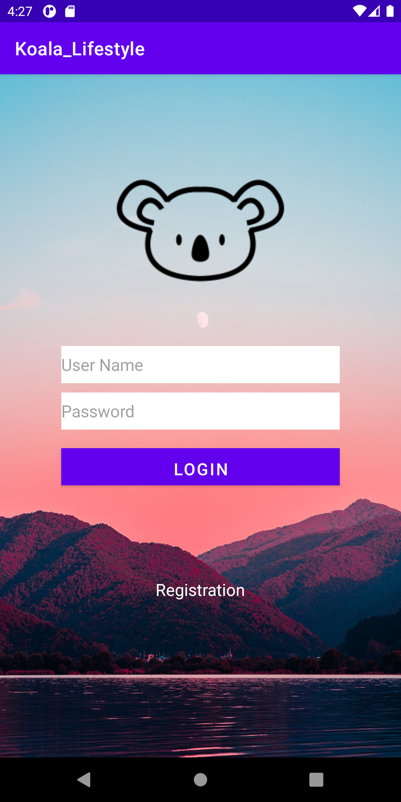
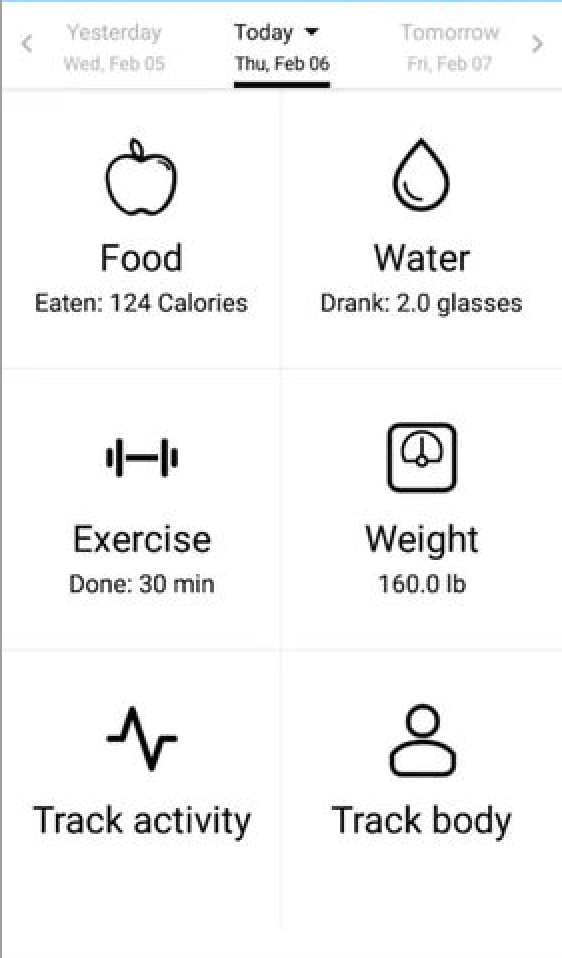

<!-- Koala Lifestyle Android Version -->
 

 
 
  <h3 align="center">Koala Lifestyle</h3>
  

    Welcome to the koala lifestyle! 
     
    <a href="https://github.com/michaelravina/Koala-Airlines-Lifestyle"><strong>Explore the docs »</strong></a>
     
  

<!-- TABLE OF CONTENTS -->

  
Table of Contents

  <ol>
    <li>
      <a href="#about-the-project">About The Project</a>
      <ul>
        <li><a href="#built-with">Built With</a></li>
      </ul>
    </li>
    <li><a href="#usage">Usage</a></li>
    <li><a href="#contact">Contact</a></li>
    <li><a href="#acknowledgements">Acknowledgements</a></li>
  </ol>

<!-- ABOUT THE PROJECT -->
## About The Project

The Covid pandamic has definitely impacted many lives, none so much within the airline industry! To cope with the losses, the company has decided to diversify its portfolio by investing on a lifestyle app. The Koala Lifestyle app is able to accept users and store their data into a SQLite database. Users are offered a possible variety of choices such as food, water & exercise options.  

### Built With

* [Android Studio](https://developer.android.com/studio?gclid=Cj0KCQiAvP6ABhCjARIsAH37rbTfBB9sdgYarNpuderu7IC2Ve-WemUV0SRk6v_KcleHRqLxLYG6EG8aAjA1EALw_wcB&gclsrc=aw.ds)
* [Java](https://www.java.com/en/)

<!-- USAGE EXAMPLES -->
## Usage

A step by step guide on how to use the app: 

1. Above is the login page of Koala Lifestyle, this is usually the first point of contact for most users.

2. New users will have to click the "Registration" button and input their desired username & verify their password.

3. Once logged in, users will be then directed to the welcome page of the app.

4. Here we see the different options available to the user wherein he/she would be able to use in having a healthier lifestyle. 

<!-- CONTACT -->
## Contact

Your Name - Michael Ravina - michaelravina@yahoo.com

Project Link: [https://github.com/michaelravina/Koala-Airlines-Lifestyle]

Linkedin: [linkedin-url]: https://www.linkedin.com/in/mike-ravina-1368a11a8/

<!-- ACKNOWLEDGEMENTS -->
## Acknowledgements
Tutorial Links on how to build your own app 
Part 1: [https://www.youtube.com/watch?v=mPhqDzO7PUU&t=748s]

Part 2: [https://www.youtube.com/watch?v=kSVdHOWkTog]

Part 3: [https://www.youtube.com/watch?v=EeTcKBXgrCc&t=37s]
